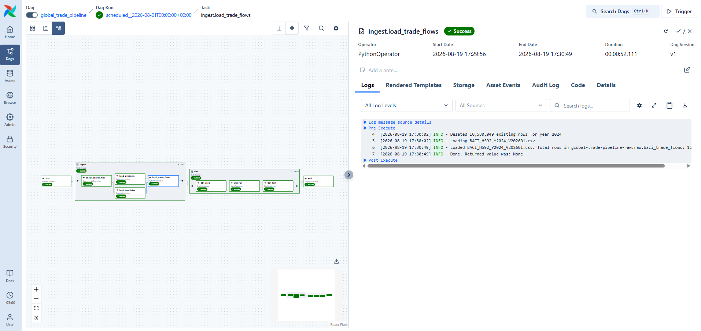

# Global Trade Pipeline

End-to-end **analytics engineering pipeline** for international trade data — from raw bilateral trade flows (118M+ rows) to an analytics-ready dimensional model on BigQuery, served in Power BI.

**Stack:** Python · dbt · BigQuery · Airflow 3 · Docker · Power BI

---

## Overview

This project ingests global **import/export** data (bilateral trade flows by country and product, HS6 level), transforms it into a clean dimensional warehouse with dbt, and serves it in Power BI. It answers questions like:

- What are a country's main trading partners, and how have they evolved?
- Which products drive a country's trade balance?
- How concentrated are global markets for a given product?

The emphasis is on **production-minded engineering** on a real data volume — incremental modeling, partitioning/clustering, testing, and working within hard cloud quotas — not a one-off notebook.

## Architecture

The pipeline is split across **two BigQuery projects on purpose** (see *Engineering decisions* for why):

```
BACI / CEPII  (annual CSV bulk download, 2014–2024)
      │   Python ingestion (ingestion/load_baci_to_bigquery.py)
      │   orchestrated by Airflow 3 on Docker (airflow/)
      ▼
┌─────────────────────────────────────────────┐
│ BigQuery project: global-trade-pipeline-raw │   RAW layer (isolated)
│   raw.baci_trade_flows / country / product  │
└─────────────────────────────────────────────┘
      │   cross-project read (dbt sources)
      ▼
┌─────────────────────────────────────────────┐
│ BigQuery project: global-trade-pipeline      │   MODELED layer (dbt)
│   staging (views) → dims (tables) → fact     │
└─────────────────────────────────────────────┘
      │
      ▼
   Power BI report
```

### Orchestration in action



The whole pipeline runs as one Airflow DAG — 9 tasks in 125 seconds, ingestion through dbt
tests. Task-by-task breakdown and design reasoning in [`airflow/README.md`](airflow/README.md).

## Tech stack

| Layer | Tool | Role |
|---|---|---|
| Ingestion | **Python** | Loads the BACI CSVs into the BigQuery raw layer |
| Warehouse | **BigQuery** (free tier, billing enabled) | Serverless storage + SQL engine, two projects |
| Transformation | **dbt** | staging → dims → fact, with tests and YAML docs |
| Orchestration | **Apache Airflow 3** | Schedules and sequences ingestion → dbt run → dbt test |
| Containerisation | **Docker Compose** | Reproducible 5-service Airflow stack (incl. Postgres metadata DB) |
| BI | **Power BI** | Report on the dimensional model (BigQuery connector) |

## Data source

**BACI (CEPII)** — cleaned, reconciled bilateral trade dataset derived from UN Comtrade.
Grain: exporter × importer × HS6 product × year. Values in thousand USD, quantities in metric tons.
Scope loaded: **2014–2024**, ~200 countries, ~5,000 products → **118,692,599 rows**.

> **Gotcha handled:** HS6 product codes are read as **STRING**, never numeric, to preserve leading zeros.

## Data model

**Staging (views — zero storage):**
- `stg_countries`, `stg_products`, `stg_trade_flows` — typed columns, renamed, NULLs handled.

**Dimensions (tables):**
- `dim_country` (~238 rows), `dim_product` (~5,022 rows).

**Fact (incremental table):**
- `fact_trade_flows` — **118.7M rows**, grain HS6 × exporter × importer × year.
- Config:
  - `materialized = incremental`
  - `incremental_strategy = insert_overwrite`
  - `partition_by = year` (range 2014–2025)
  - `cluster_by = [exporter_code, importer_code]`
  - `on_schema_change = sync_all_columns`

**Tests:** 34 passing — `not_null`, `unique`, `accepted_values`, and `relationships` (referential integrity between fact and dims).

## Engineering decisions

### 1. Two BigQuery projects to live within the free-tier quota
The BigQuery Sandbox caps storage at **10 GB per project**. A full `dbt build` failed with `Quota exceeded: free storage for projects`, even though running `fact_trade_flows` in isolation worked.

**Diagnosis** (via `__TABLES__` byte counts): the project already held **raw (4.57 GB) + fact (5.67 GB) = 10.24 GB** at rest — *already over the cap*. Any temporary table the build created tipped it over. It was **not** fact duplication (incremental doesn't duplicate), **not** staging materialized as tables (they were already views), and **not** orphaned junk.

**Solution:** because the 10 GB quota is **per project**, the raw layer was moved to a **second BigQuery project** (`global-trade-pipeline-raw`). The dbt sources now read **cross-project**; the main project keeps only the fact (5.67 GB) with ~4.3 GB of headroom. Billing was also enabled (required for DML/incremental runs) — cost stays within the free tier limits.

### 2. Incremental fact instead of full rebuild
At 118M rows, rebuilding the fact on every run is wasteful and storage-spiky. `incremental` + `insert_overwrite` rewrites **only the affected year partitions**, keeping runs fast and storage flat.

### 3. Partitioning + clustering
`partition_by = year` lets BI queries scan a single year instead of the whole table (cheaper, faster, friendlier to the 1 TB/month query quota). `cluster_by [exporter_code, importer_code]` speeds up the most common filters (by partner country).

### 4. Orchestration that matches the source's cadence
BACI publishes **once a year**, on no fixed date. The DAG therefore runs monthly and opens with
a `ShortCircuitOperator` that checks whether the year's CSVs have landed — ingestion skips when
they have not, while the dbt branch still runs (`trigger_rule=NONE_FAILED`) so the models stay
fresh and the tests keep guarding the warehouse. Every task is scoped to one `target_year` and
the loader deletes that year before appending it, making retries and backfills idempotent.

Full reasoning in [`airflow/README.md`](airflow/README.md).

### 5. Staging as views
Staging models are **views**, not tables — zero storage cost, and the typing/cleaning logic stays close to the raw without duplicating 100M+ rows.

## How to run

### Prerequisites
- Python 3.11
- Two BigQuery projects in **`us-central1`**: `global-trade-pipeline` (models) and `global-trade-pipeline-raw` (raw)
- A GCP service account key at `credentials/dbt-service-account-key.json` with access to **both** projects
- BACI CSV files in `data/` (not committed — see below)

### Get the data
Download the BACI **HS92, release V202601** bundle from CEPII
([dataset page](https://www.cepii.fr/CEPII/en/bdd_modele/bdd_modele_item.asp?id=37)) and
unzip it into `data/`:

```bash
curl -L -o data/BACI_HS92_V202601.zip https://www.cepii.fr/DATA_DOWNLOAD/baci/data/BACI_HS92_V202601.zip
unzip data/BACI_HS92_V202601.zip -d data/
```

The bundle covers 1995–2024; this project loads **2014–2024**
(`BACI_HS92_Y2014_V202601.csv` … `BACI_HS92_Y2024_V202601.csv`) plus
`country_codes_V202601.csv` and `product_codes_HS92_V202601.csv`.

### Setup
```bash
py -3.11 -m venv .venv
.venv\Scripts\activate
pip install -r requirements.txt
```

### 1. Ingest raw data
```bash
python ingestion/load_baci_to_bigquery.py             # full initial load (all years)
python ingestion/load_baci_to_bigquery.py --year 2024 # one year, idempotent (re-runnable)
```

### 2. Build and test the models
```bash
cd global_trade_pipeline
dbt seed   # reference data: country regions, HS2 descriptions
dbt run
dbt test
```

### 3. Run the whole thing under Airflow
Airflow needs a POSIX environment, so it runs in Docker — five services, including the
Postgres metadata database. Full reasoning in [`airflow/README.md`](airflow/README.md).

```bash
cd airflow
cp .env.example .env      # then point GCP_KEY_DIR at your key directory
docker compose up -d      # UI on http://localhost:8080  (admin / admin)
```

The DAG arrives paused; unpause it to run. A verified end-to-end run completes in
**125 seconds** — see the task-by-task breakdown in [`airflow/README.md`](airflow/README.md).

## Known limitations (free tier)

- **Avoid `dbt run --full-refresh`** on the fact: it re-reads the entire raw cross-project and recreates the table, causing a storage peak that can exceed the 10 GB quota. Use normal incremental runs.
- **Cross-project read depends on the auth identity** (service account vs. OAuth user in `profiles.yml`). Switching identities without granting access to the raw project breaks the build with an access error.
- **Both projects must be in the same region (`us-central1`).** Cross-project reads do not work across regions.

## Roadmap

- [x] Ingestion (Python → BigQuery raw)
- [x] dbt staging → dims → incremental fact (34 tests passing)
- [x] Storage-quota solution (two-project split)
- [x] Airflow 3 DAG orchestrating ingestion → dbt run → dbt test (verified green, 125s)
- [x] Docker Compose stack (Airflow + Postgres, reproducible)
- [ ] Power BI report (publish to web) **← v1 publishable**
- [ ] Streamlit app (public link)
- [ ] GitHub Actions CI (dbt tests on push)

## Author

**Flavio Ribeiro Córdula** — Data Analyst / Analytics Engineer
[LinkedIn](https://www.linkedin.com/in/cordulaflavio) · [GitHub](https://github.com/cordulaflavio)
