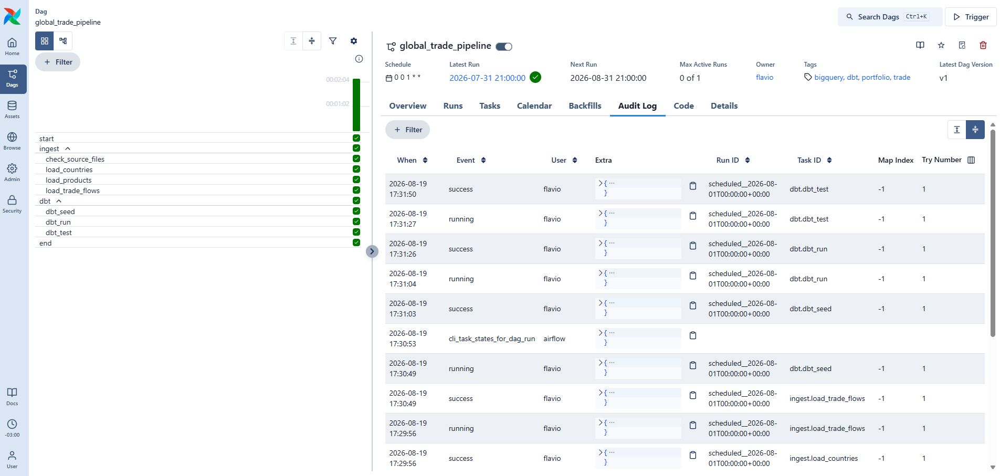

# Orchestration — Apache Airflow 3

[`dags/global_trade_pipeline.py`](dags/global_trade_pipeline.py) orchestrates the whole
pipeline: BACI CSVs → BigQuery raw → dbt models → dbt tests.

```
start
  │
  ├─ ingest ─────────────────────────────────────────┐
  │    check_source_files  (ShortCircuitOperator)     │
  │            │                                      │
  │            ├─ load_countries    ─┐                │
  │            └─ load_products     ─┴─ load_trade_flows
  │                                                   │
  └─ dbt ────────────────────────────────────────────┤
       dbt_seed  →  dbt_run  →  dbt_test              │
                                                     end
```


**Verified run** (2026-08-19, Airflow 3.3.1, LocalExecutor): 9/9 tasks succeeded in **125 s**.

| Task | Duration | What it actually did |
|---|---|---|
| `check_source_files` | 3 s | Found the year's CSVs on the mounted volume |
| `load_countries` / `load_products` | 6 s | Reloaded the reference tables |
| `load_trade_flows` | 52 s | Deleted BigQuery year 2024 and reloaded **10,580,049 rows** |
| `dbt_seed` | 13 s | Reloaded both seeds |
| `dbt_run` | 23 s | Rebuilt views, dimensions, and the 2024 fact partition |
| `dbt_test` | 24 s | 34 data tests |

Afterwards `raw` and `fact_trade_flows` both still held **118,692,599 rows** — the run
replaced a year and left the totals identical, which is idempotency demonstrated rather
than asserted.



## Design decisions

### 1. Annual source, monthly schedule

BACI/CEPII publishes **one release per year**, on no fixed date. A yearly schedule would
give the pipeline a single chance to notice a late release; a daily one would burn
BigQuery quota rebuilding nothing.

So the DAG runs **monthly** and opens with a `ShortCircuitOperator` that checks whether
the target year's CSVs are actually on disk. If they are not, ingestion skips.

The subtlety is `ignore_downstream_trigger_rules=False`. By default a short-circuit skips
*everything* downstream, which would kill the dbt branch too. Setting it to `False` keeps
the skip local — only directly downstream tasks are skipped — and `dbt_seed` then declares
`trigger_rule=NONE_FAILED` so the dbt branch runs anyway. On a no-new-data month the models
are still refreshed and **the tests still run**, which is the point of having them.

### 2. Idempotency, so retries and backfills are safe

Every run is scoped to one `target_year` (an Airflow `Param`, overridable at trigger time).
The loader **deletes that year before appending it**, so running the task once or five times
leaves the same table state. Without this, a retry after a partial failure would silently
duplicate ~10.6M rows.

The same property holds downstream: `fact_trade_flows` is `incremental` with
`insert_overwrite`, so dbt rewrites whole year partitions rather than accumulating rows.

### 3. `max_active_runs=1`

dbt has no locking. Two runs writing the same relations race each other — during
development, two concurrent `dbt build` invocations left the `hs2_descriptions` seed with
194 rows instead of 97, which `unique_hs2_descriptions_hs2_code` caught and which correctly
blocked `dim_product` from building on top of it. One writer at a time is not a formality.

### 4. Airflow and dbt in separate virtualenvs

Airflow pins a large dependency tree through its constraints file; dbt pins its own. Putting
them in one environment is a well-known way to get an unsolvable resolver conflict.

Inside the image they live at `/usr/local/...` and `/home/airflow/dbt-venv`, and the DAG
bridges them with the `DBT_BIN` environment variable — the `BashOperator` calls dbt's own
entry point. `dbt-core` is pinned explicitly in `requirements.txt`; left to the resolver the
container drifted onto a different version than the local checkout.

### 5. One dbt command per task

`dbt build` would be fewer tasks, but `dbt seed` / `dbt run` / `dbt test` as three tasks makes
the failure legible straight from the UI: a red `dbt_run` is a build problem, a red `dbt_test`
is a **data quality** problem. Different pages, different fixes.

`dbt_test` also sets `retries=0` — a failing test is a real assertion about the data, not a
flaky network call, and retrying it would only delay the alert.

### 6. Configuration through the environment; credentials never in the image

No path, project id, or credential is hardcoded in the DAG. The ingestion module reads the
same variables whether it runs under Airflow or from a terminal, so the identical code path
is exercised both ways:

```bash
python ingestion/load_baci_to_bigquery.py --year 2024   # same code the DAG task runs
```

The service account key is **mounted read-only at run time**, never copied into the image —
an image carrying a credential leaks it to everyone who can pull it. The committed
[`dbt-profile/profiles.yml`](dbt-profile/profiles.yml) holds only the *path* to that key.
The developer's personal `~/.dbt/profiles.yml` is deliberately **not** mounted — it holds
credentials for unrelated projects, and none of that belongs inside a container.

### 7. LocalExecutor, not Celery

The official Airflow compose file runs seven containers. `CeleryExecutor` buys horizontal
scaling across machines, which a single-DAG pipeline does not need; `LocalExecutor` still
runs tasks in parallel, at a fraction of the operational surface.

Airflow 3 splits responsibilities that Airflow 2 kept together, so this stack runs five
services rather than three:

| Service | Role |
|---|---|
| `postgres` | Airflow's metadata database — DAG runs, task states, users |
| `airflow-init` | Runs once: migrates the schema, creates the admin user, exits |
| `airflow-apiserver` | UI **and** the Task Execution API (replaces Airflow 2's `webserver`) |
| `airflow-scheduler` | Decides what runs when |
| `airflow-dag-processor` | Parses DAG files in its own process, so a bad DAG cannot stall the scheduler |
| `airflow-triggerer` | Only needed by deferrable operators; included so the health panel is honestly green |

The metadata database is the piece people underestimate: it is what makes the UI green or
red, what allows a retry, and what stops the same run executing twice. SQLite cannot handle
concurrent writes, which is why `airflow standalone` is limited to one task at a time and is
never a production answer.

## Running it

```bash
cd airflow
cp .env.example .env      # then point GCP_KEY_DIR at your key directory
docker compose up -d
```

UI on **http://localhost:8080**, user `admin` / `admin`.

The DAG arrives **paused** on purpose: its monthly schedule has intervals already in the
past, so an unpaused DAG fires the moment the scheduler starts. Unpause it — or hit
*Trigger* — when you actually want it to run.

Useful commands:

```bash
docker compose logs -f airflow-scheduler     # follow the scheduler
docker compose down                          # stop, keeping run history
docker compose down -v                       # stop and wipe the metadata database

# Airflow 3 changed the CLI; querying the metadata database is the quickest inspection:
docker compose exec -T postgres psql -U airflow -d airflow \
  -c "select task_id, state from task_instance where dag_id='global_trade_pipeline';"
```

### What gets mounted

Only these paths exist inside the container — nothing else on the host is visible to it:

| Host | Container | Mode |
|---|---|---|
| `airflow/dags` | `/opt/airflow/dags` | rw |
| `ingestion/` | `/opt/airflow/ingestion` | rw |
| `global_trade_pipeline/` | `/opt/airflow/dbt` | rw (dbt writes `target/`) |
| `airflow/dbt-profile` | `/opt/airflow/dbt-profile` | **ro** |
| `data/` | `/opt/airflow/data` | **ro** — 3.6 GB, mounted not copied, so it stays out of the image |
| `$GCP_KEY_DIR` | `/opt/airflow/gcp` | **ro** |

## Production deployment (not built)

This is a local development stack. A real deployment would be Cloud Composer or Astronomer:
a managed Postgres, `KubernetesExecutor` for per-task isolation, the service account supplied
by **Workload Identity** instead of a mounted key file, the CSVs staged in GCS rather than on
a laptop's disk, and the DAG delivered by a git-sync bundle rather than a bind mount.
